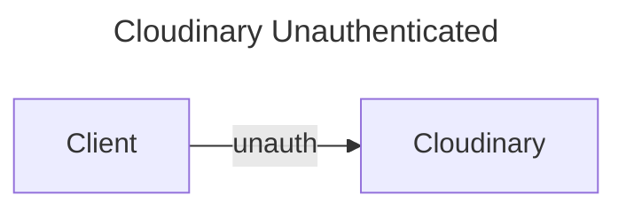

## Cloudinary

Cloudinary offers the following APIs:
- [Upload API](https://cloudinary.com/documentation/upload_images):methods for uploading assets, creating new assets such as text images, ZIP files and sprites, and transforming existing assets.
- [Admin API](https://cloudinary.com/documentation/admin_api): A secure API with methods for browsing, deleting, and restoring existing assets, and for managing upload presets, upload mappings, and transformations. This API also includes
   - [Search API](https://cloudinary.com/documentation/search_api)
   - [Metadata API](https://cloudinary.com/documentation/metadata_api)
- [Provisioning API](https://cloudinary.com/documentation/provisioning_api) A secure API that enables account administrators to create and manage their account, product environments, users and user groups programmatically.
- [URL API](https://cloudinary.com/documentation/image_transformations) - a URL-based API for delivering assets. Includes dynamic asset transformations, fetching remote assets, and optimizing delivery of the assets. Asset URLs are dynamically mapped to CDN distributions that forward the requests to Cloudinary servers which generate the transformed asset on-demand and deliver them optimized to users.

### Usage

#### Authenticated vs Unauthenticated Requests
Authenticated requests can perform any type of processing and has access to all of Cloudinary's capabilities. **Note** signatures need to be generated on the service side because they required knowledge and access to the API Secret.
```mermaid
---
title: Cloudinary Authenticated
---
graph LR;
Client-- params -->Service
Client<-- signature --Service
Client-- auth -->Cloudinary
```
On edge clients, like browsers you may not want to manage the Cloudinary secret needed to generate a signature. Unauthenticated requests allow image uploads without the need for a signature. The downside is they are limited in their capabilities. Unauthenticated uploaded must be enabled, and they need run through a specific set of filtering and processing rules.


#### Cloud Name 
Every Cloudinary request requires a *cloud-name*. You can find our production *cloud-name* on our **Account** page via Left Hand Nav the [settings](https://console.cloudinary.com/settings/). 

The *cloud-name* is embedded into our URLs. For example if you want to upload an image you would use the URL

`https://api.cloudinary.com/v1_1/cloud-name/image/upload`

#### Example Unauthenticated Upload
There are only two required parameters for Unauthenticated Uploads. **tokenmedia** is an existing ENF preset for token related images.
- file: URL or path to image
- upload_preset: ruleset name to filter and process content

`curl https://api.cloudinary.com/v1_1/cloud-name/image/upload -X POST --data 'file=sample.jpg&upload_preset=tokenmedia'`

[GitHub example code](https://github.com/cloudinary-devs/cld-form-unsigned-upload) for unauthenticated upload from a form. 

#### Example Authenticated Upload
You may find the API Key under **Access Keys** on our **Account** page via Left Hand Nav the [settings](https://console.cloudinary.com/settings/).
- file: URL or path to image
- api_key: unique API of our cloudinary account. 
- timestamp: unix time in seconds since epoch
- signature: valid for 1 hour and generated off all parameters except file, api_key, cloud_name, or resource_type
You can read more about [signatures and manually generating signatures](https://cloudinary.com/documentation/upload_images#generating_authentication_signatures) here. 
**Example Request**
`curl https://api.cloudinary.com/v1_1/cloud-name/image/upload -X POST --data 'file=sample.jpg&timestamp=173719931&api_key=436464676&signature=a781d61f86a6f818af'`
**Example Response**
```json
{
  "asset_id": "b5e6d2b39ba3e0869d67141ba7dba6cf",
  "public_id": "eneivicys42bq5f2jpn2",
  "version": 1570979139,
  "version_id": "98f52566f43d8e516a486958a45c1eb9",
  "signature": "abcdefghijklmnopqrstuvwxyz12345",
  "width": 1000,
  "height": 672,
  "format": "jpg",
  "resource_type": "image",
  "created_at": "2023-03-11T12:24:32Z",
  "tags": [],
  "pages": 1,
  "bytes": 350749,
  "type": "upload",
  "etag": "5297bd123ad4ddad723483c176e35f6e",
  "placeholder": false,
  "url": "http://res.cloudinary.com/demo/image/upload/v1570979139/eneivicys42bq5f2jpn2.jpg",
  "secure_url": "https://res.cloudinary.com/demo/image/upload/v1570979139/eneivicys42bq5f2jpn2.jpg",
  "folder": "",
  "access_mode": "public",
  "existing": false,
  "original_filename": "sample"
}
```
**Direct Browser Upload**
From an authenticated client session you can use cloudinary's library to generate the cloudinary request and all the parameters. 

https://cloudinary.com/documentation/upload_images#direct_uploading_from_the_browser_via_a_backend_sdk


### Solution Overview
Reviews cloud infrastructure and setup. 
https://cloudinary.com/documentation/solution_overview

### 

